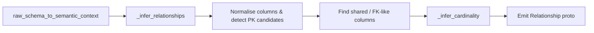
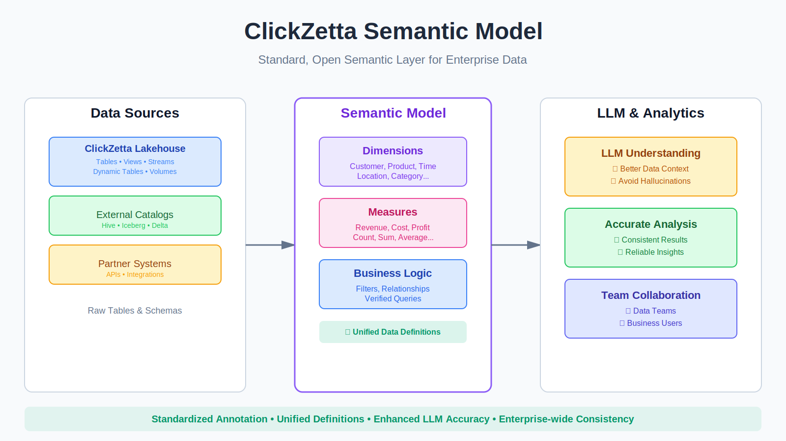

# Relationship Inference Design

This document explains how the ClickZetta semantic model generator infers joins between tables when building semantic YAML. It summarises the current implementation in `semantic_model_generator/generate_model.py` (commit `b147a60`), incorporates the Phase 1 improvements.

The design is intentionally conservative: it prefers missing joins over incorrect joins and defaults to `many_to_one` when evidence is weak.

### Visual Overview





---

## 1. Entry Points and Data Flow

1. `raw_schema_to_semantic_context` (`semantic_model_generator/generate_model.py:716`) orchestrates semantic model generation. Once table metadata is collected it invokes `_infer_relationships`.
2. `_infer_relationships` (`semantic_model_generator/generate_model.py:529`) receives a list of `(FQNParts, Table)` pairs. Each `Table` contains column metadata, sample values, and the `is_primary_key` flag (if provided by ClickZetta metadata).
3. The helper returns a list of `semantic_model_pb2.Relationship` objects that the generator emits into the resulting semantic model.

```
raw_schema_to_semantic_context()
    └── fetch metadata via clickzetta connector
    └── assemble proto tables
    └── relationships = _infer_relationships(raw_tables_metadata)
            ├── gather normalization caches
            ├── detect column pairs likely to be FK→PK
            └── build relationship protos (type + columns)
```

---

## 2. Supporting Helpers

| Helper | Purpose | Location |
|--------|---------|----------|
| `_identifier_tokens` | Split identifiers into uppercase tokens, stripping generic prefixes. | `generate_model.py:69` |
| `_sanitize_identifier_name` | Normalise identifiers for comparison (remove prefixes, collapse underscores). | `generate_model.py:85` |
| `_table_variants` / `_looks_like_primary_key` | Generate table-name variants and detect PK-style column names. | `generate_model.py:211`, `:263` |
| `_levenshtein_distance`, `_name_similarity` | Provide fuzzy column-name similarity scoring (Phase 1). | `generate_model.py:343`, `:366` |
| `_looks_like_foreign_key` | Predict if a column name resembles a FK referencing a target table (Phase 1). | `generate_model.py:439` |
| `_infer_cardinality` | Combine metadata and sampling evidence to derive relationship cardinality. | `generate_model.py:396` |

---

## 3. Relationship Discovery Pipeline

### 3.1 Normalised Metadata Cache
For each table the helper builds a metadata structure keyed by the normalised column name:

```python
columns_meta[normalized_name] = {
    "names": [original names encountered],
    "base_type": base data type token,
    "values": sampled values (for NDV heuristics),
    "is_identifier": bool,
    "is_primary": bool (direct metadata),
}
pk_candidates[normalized_name] = [original names considered PK]
```

Generic prefixes (e.g., `DIM_`, `FACT_`, `STG_`) are removed during normalisation to support warehouses that prefix table/column names.

### 3.2 Direct Shared-Key Matches
Tables that share a normalised column token with matching data types are considered first. Depending on whether the column participates in a PK candidate list the algorithm records one or more `(left, right)` column pairs using `_record_pair`.

### 3.3 Heuristic FK Detection (Phase 1)

For each PK candidate in table A, the algorithm scans columns in table B and applies:

1. **Direct suffix match** – `order_date_id` ends with `date_id`.
2. **Name similarity** – use `_name_similarity` to tolerate abbreviations (`customer_id` vs `cust_id`).
3. **FK-lookalike check** – `_looks_like_foreign_key` detects patterns such as:
   - `{table}_id`, `{table}_key`, `{table}Id`, etc.
   - Multi-token forms (`order_customer_id`).
   - Prefix+PK combinations (`ordercustomerid`).

Pairs are recorded in both directions to cover fact→dimension and dimension→fact naming styles.

### 3.4 Relationship Construction
For each `(left_table, right_table)` bucket:

1. Determine whether either side contributes PK columns.
2. Retrieve the sampled values for the first column pair (used by cardinality heuristics).
3. Use `_infer_cardinality` to classify each side as `1` or `*`.
4. Map `(left_card, right_card)` to a `RelationshipType`:
   - `("1","1")` → `one_to_one`
   - `("*","1")` → `many_to_one`
   - `("1","*")` → `one_to_many`
   - Any other combination defaults to `many_to_one` for safety.
5. Emit the `Relationship` proto with `join_type=inner` and one `RelationKey` per column pair.
6. Log a debug line summarising the decision: `Cardinality inference for FACT_SALES -> DIM_CUSTOMER: *:1 (samples: L=10, R=6, PKs: L=False, R=False)`.

---

## 4. Cardinality Inference Rules

The regression fix introduced a three-stage prioritisation in `_infer_cardinality`:

1. **Primary-key metadata wins** – if one side is tagged as PK (and the other is not) we derive `*:1` or `1:*`. Two PKs imply `1:1`.
2. **Sampling heuristics require sufficient evidence** – uniqueness ratios are only trusted when *both* sides have at least 50 sampled values (`MIN_SAMPLE_SIZE`). This mitigates the “accidental uniqueness” issue documented in `CARDINALITY_FIX_REPORT.md`.
3. **Fallback default** – without strong evidence we return `("*","1")` (interpreted as `many_to_one`).

The thresholds align with the quick-reference guidance:

| Constant | Value | Purpose |
|----------|-------|---------|
| `MIN_SAMPLE_SIZE` | 50 | Guard uniqueness-based inference. |
| `UNIQUENESS_THRESHOLD` | 0.95 | Treat columns with ≥95 % unique samples as potential keys. |
| Default cardinality | `("*","1")` | Avoid incorrect 1:1 claims. |

---

## 5. Configuration and Tuning

| Lever | Default | Impact |
|-------|---------|--------|
| `_DEFAULT_N_SAMPLE_VALUES_PER_COL` (`generate_model.py:37`) | 10 | Controls how many distinct values are collected per column. Increase this (e.g., 50/100) when you need more robust inference. |
| UI “Maximum number of sample values per column” (`app_utils/shared_utils.py:1355`) | 10 (range 10‑500) | Mirrors the backend default; users can raise the sampling cap per run. |
| Strict join inference toggle (`app_utils/shared_utils.py:1388` & `_infer_relationships`) | Off by default | When enabled, runs `… WHERE fk IS NULL LIMIT 1` to confirm nullable foreign keys at the cost of extra queries. |
| Relationship type editing | Manual | Users can always adjust the emitted YAML if domain knowledge contradicts the heuristic. |

---

## 6. Logging and Diagnostics

- `logger.debug` lines during cardinality inference surface sample counts and PK flags.
- `logger.info(f"Inferred {len(relationships)} relationships across {len(raw_tables)} tables")` summarises coverage.
- Additional debug logging from the connector (`clickzetta_connector.py`) records metadata queries; this is useful when `is_primary_key` metadata is missing.

**Sample log sequence**

```
INFO  Pulling column information from QUICK_START.SEMANTIC_MODEL_TEST.FACT_SALES
INFO  Pulling column information from QUICK_START.SEMANTIC_MODEL_TEST.DIM_CUSTOMER
DEBUG Cardinality inference for FACT_SALES -> DIM_CUSTOMER: *:1 (samples: L=10, R=6, PKs: L=False, R=True)
INFO  Inferred 4 relationships across 5 tables
```

---

## 7. Testing

Automated coverage:

- `semantic_model_generator/tests/relationships_filters_test.py` exercises the default pipeline and ensures relationships are emitted without regressions.
- `test_cardinality_standalone.py` (ad hoc script referenced in the reports) validates the threshold logic and small-sample fallback.

Manual verification steps:

1. Generate a model with `allow_joins=True` and verify the emitted relationships in the YAML.
2. Edit the sample-size select box if you need more than the default 10 samples, then confirm the log lines reflect the new size.
3. Inspect the debug logs to confirm the expected cardinality decisions.

---

## 8. Known Limitations and Future Work

| Area | Current Behaviour | Potential Enhancements |
|------|-------------------|------------------------|
| Composite keys | Only first column of each pair is sampled for cardinality; multi-column PK→FK detection remains heuristic. | Analyse all column pairs jointly, or incorporate ClickZetta composite-key metadata when available. |
| Many-to-many detection | Defaults to `many_to_one`. | Require explicit bridge-table detection or manual markup. |
| Performance on very large schemas | Heuristics operate in-memory and scale quadratically with the number of tables due to nested loops. | Add pruning (e.g., schema hints) or parallelise when the table list is large. |
| Coverage reporting | No user-facing summary of “why” a relationship was inferred. | Expose diagnostic strings (PK metadata, name similarity score, sample counts) for UI inspection. |

---

## 9. Summary

The current relationship inference stack is built around conservative heuristics:

1. Collect as much structural metadata as ClickZetta exposes.
2. Normalise identifiers to handle divergent naming conventions.
3. Use fuzzy matching to catch obvious FK patterns without overstating confidence.
4. Protect against small-sample misclassification by preferring `many_to_one`.

The combination of Phase 1 improvements and the cardinality fix delivers a safer baseline for ClickZetta semantic models while leaving room for future iterations (e.g., composite-key support, bridge-table detection, or machine-learned scoring).

---

## Appendix A — Worked Example

**Input tables**

| Column | FACT_SALES | DIM_CUSTOMER |
|--------|------------|--------------|
| `customer_id` | sample values `[1002, 1012, 1003, ...]` | sample values `[1003, 1005, 1012, ...]` |
| `order_date_id` | `[20240115, 20240415, ...]` | — |
| `date_id` | — | `[20240115, 20240415, ...]` |

**Steps**

1. `_identifier_tokens` normalises both `customer_id` columns to `CUSTOMER_ID`; the shared token becomes a candidate key pair.
2. Metadata from ClickZetta marks `DIM_CUSTOMER.customer_id` as `is_primary_key=True`, so `_record_pair` registers `(FACT_SALES.customer_id → DIM_CUSTOMER.customer_id)`.
3. `order_date_id` (fact table) is compared against `date_id` (dimension) and matched via the suffix rule (`ORDER_DATE_ID.endswith(DATE_ID)`).
4. `_infer_cardinality` sees the right column flagged as PK and emits `("*","1")`; even if sampled values are unique on the left, the PK heuristic dominates.
5. The resulting YAML fragment:

```yaml
relationships:
  - name: FACT_SALES_to_DIM_CUSTOMER
    left_table: FACT_SALES
    right_table: DIM_CUSTOMER
    relationship_type: many_to_one
    join_type: inner
    relationship_columns:
      - left_column: customer_id
        right_column: customer_id
```

This example mirrors the regression case tracked in `CARDINALITY_FIX_REPORT.md` and demonstrates how the updated pipeline avoids 1:1 misclassification when sample sizes are small.
