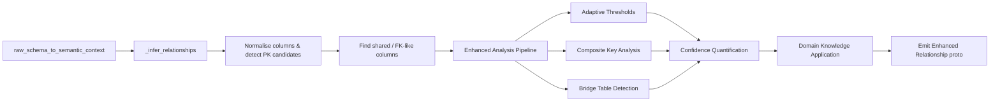

# Relationship Inference Design

This document explains how the ClickZetta semantic model generator infers joins between tables when building semantic YAML. It summarises the enhanced implementation in `semantic_model_generator/generate_model.py` with comprehensive optimizations including composite key support, intelligent thresholding, many-to-many detection, confidence quantification, and domain knowledge integration.

The design is intentionally conservative: it prefers missing joins over incorrect joins and defaults to `many_to_one` when evidence is weak. Recent enhancements significantly improve accuracy while maintaining this conservative approach.

### Visual Overview




---

## 1. Entry Points and Data Flow

1. `raw_schema_to_semantic_context` orchestrates semantic model generation. Once table metadata is collected it invokes `_infer_relationships`.
2. `_infer_relationships` receives a list of `(FQNParts, Table)` pairs. Each `Table` contains column metadata, sample values, and the `is_primary_key` flag (if provided by ClickZetta metadata).
3. The enhanced pipeline includes multiple analysis stages:
   - Adaptive threshold calculation based on data characteristics
   - Composite key pattern analysis for multi-column relationships
   - Bridge table detection for many-to-many relationships
   - Confidence quantification with detailed reasoning
   - Domain knowledge application for common patterns
4. The helper returns a list of `semantic_model_pb2.Relationship` objects that the generator emits into the resulting semantic model.

```
raw_schema_to_semantic_context()
    └── fetch metadata via clickzetta connector
    └── assemble proto tables
    └── relationships = _infer_relationships(raw_tables_metadata)
            ├── gather normalization caches
            ├── calculate adaptive thresholds
            ├── detect column pairs likely to be FK→PK
            ├── analyze composite key patterns
            ├── detect bridge table relationships
            ├── quantify confidence with reasoning
            ├── apply domain knowledge patterns
            └── build enhanced relationship protos
```

---

## 2. Supporting Helpers

### Core Functions

| Helper | Purpose | Location |
|--------|---------|----------|
| `_identifier_tokens` | Split identifiers into uppercase tokens, stripping generic prefixes. | `generate_model.py:69` |
| `_sanitize_identifier_name` | Normalise identifiers for comparison (remove prefixes, collapse underscores). | `generate_model.py:85` |
| `_table_variants` / `_looks_like_primary_key` | Generate table-name variants and detect PK-style column names. | `generate_model.py:211`, `:263` |
| `_levenshtein_distance`, `_name_similarity` | Provide fuzzy column-name similarity scoring. | `generate_model.py:343`, `:366` |
| `_looks_like_foreign_key` | Predict if a column name resembles a FK referencing a target table. | `generate_model.py:439` |

### Enhanced Analysis Functions

| Helper | Purpose | Key Features |
|--------|---------|--------------|
| `_detect_table_role` | Identify semantic role of tables (fact, dimension, bridge, staging) | Analyzes naming patterns and column characteristics |
| `_calculate_adaptive_thresholds` | Calculate data-driven thresholds for improved accuracy | Considers uniqueness, distribution, naming complexity |
| `_analyze_composite_key_patterns` | Detect multi-column key relationships | Handles complex composite primary/foreign keys |
| `_detect_bridge_table_pattern` | Identify bridge tables for many-to-many relationships | Recognizes junction table patterns |
| `_calculate_relationship_confidence` | Quantify inference confidence with detailed reasoning | Six evidence factors with structured explanations |
| `_apply_domain_knowledge` | Apply warehouse patterns for enhanced accuracy | Common business entities and schema patterns |

### Cardinality and Join Type Inference

| Helper | Purpose | Enhanced Features |
|--------|---------|-------------------|
| `_infer_cardinality` | Single-column cardinality inference with adaptive thresholds | Uses dynamic thresholds based on data characteristics |
| `_infer_composite_cardinality` | Multi-column cardinality inference for composite keys | Analyzes relationship patterns across multiple columns |
| `_infer_join_type` | Determine appropriate JOIN type (INNER vs LEFT OUTER) | Business semantics and table role awareness |

---

## 3. Enhanced Relationship Discovery Pipeline

### 3.1 Adaptive Threshold Calculation

Before processing relationships, the system calculates adaptive thresholds based on data characteristics:

```python
adaptive_thresholds = _calculate_adaptive_thresholds(
    values_list=[left_values, right_values],
    table_count=len(raw_tables),
    base_sample_size=base_sample_size
)
```

**Factors considered:**
- **Uniqueness distribution**: Adjusts thresholds based on data uniqueness patterns
- **Naming pattern complexity**: Considers table/column naming consistency
- **Distribution skew**: Accounts for data distribution characteristics
- **Schema complexity**: Adapts to overall schema size and complexity

### 3.2 Normalised Metadata Cache

For each table the helper builds enhanced metadata structure:

```python
columns_meta[normalized_name] = {
    "names": [original names encountered],
    "base_type": base data type token,
    "values": sampled values (for NDV heuristics),
    "is_identifier": bool,
    "is_primary": bool (direct metadata),
    "uniqueness_ratio": float,  # NEW: calculated uniqueness
    "naming_confidence": float   # NEW: naming pattern confidence
}
pk_candidates[normalized_name] = [original names considered PK]
table_roles[table_name] = detected_role  # NEW: fact/dimension/bridge/staging
```

### 3.3 Composite Key Analysis

Enhanced support for multi-column relationships:

```python
composite_analysis = _analyze_composite_key_patterns(
    table_meta=table_metadata,
    column_pairs=potential_column_pairs
)
```

**Analysis includes:**
- Multi-column primary key detection
- Composite foreign key pattern recognition
- Cross-column relationship strength assessment
- Combined uniqueness analysis

### 3.4 Bridge Table Detection

Automatic identification of many-to-many relationships:

```python
bridge_analysis = _detect_bridge_table_pattern(
    table_meta=table_metadata,
    all_tables_meta=all_tables_metadata
)
```

**Detection criteria:**
- Table has multiple foreign key-like columns
- Limited non-key attributes
- Naming patterns suggesting junction table
- Relationship patterns with other tables

### 3.5 Enhanced Relationship Construction

For each `(left_table, right_table)` bucket:

1. **Calculate adaptive thresholds** based on data characteristics
2. **Detect table roles** (fact, dimension, bridge, staging)
3. **Analyze composite key patterns** if multiple columns involved
4. **Determine cardinality** using enhanced inference:
   - Multi-column analysis for composite keys
   - Adaptive threshold application
   - Business logic consideration
5. **Infer JOIN type** based on:
   - Table roles and business semantics
   - Null foreign key detection (if strict mode enabled)
   - Time dimension relationships
6. **Calculate confidence score** with detailed reasoning
7. **Apply domain knowledge** to enhance accuracy
8. **Emit relationship proto** with comprehensive metadata

---

## 4. Enhanced Cardinality Inference

### 4.1 Single-Column Analysis with Adaptive Thresholds

Enhanced `_infer_cardinality` with dynamic threshold adjustment:

1. **Primary-key metadata wins** – highest priority for explicit PK information
2. **Adaptive sampling heuristics** – thresholds adjust based on:
   - Data uniqueness distribution
   - Naming pattern confidence
   - Sample size reliability
   - Schema complexity factors
3. **Conservative fallback** – defaults to `("*","1")` when evidence is insufficient

### 4.2 Composite Key Analysis

New `_infer_composite_cardinality` for multi-column relationships:

1. **Combined uniqueness analysis** across all column pairs
2. **Cross-column correlation** assessment
3. **Composite key pattern** recognition
4. **Enhanced confidence** through multiple evidence sources

### 4.3 Adaptive Threshold Configuration

| Threshold Type | Base Value | Adaptive Factors |
|----------------|------------|------------------|
| `min_sample_size` | 50 | Schema complexity, table count |
| `uniqueness_threshold` | 0.95 | Data distribution skew |
| `naming_confidence_threshold` | 0.7 | Naming pattern consistency |
| `composite_strength_threshold` | 0.6 | Multi-column relationship strength |

---

## 5. Confidence Quantification System

### 5.1 Six Evidence Factors

The confidence system evaluates relationships across six dimensions:

1. **Primary Key Metadata (0.4 max)**: Explicit PK information from database
2. **Name Similarity (0.3 max)**: Column name matching and FK patterns
3. **Sample Data Uniqueness (0.25 max)**: Uniqueness ratios with adaptive thresholds
4. **Data Type Compatibility (0.15 max)**: Compatible data types and sizes
5. **Business Logic (0.2 max)**: Table roles and relationship contexts
6. **Composite Keys (0.1 max)**: Multi-column relationship strength

### 5.2 Confidence Levels

| Score Range | Level | Description | Usage |
|-------------|-------|-------------|-------|
| 0.8 - 1.0 | Very High | Strong evidence across multiple factors | Auto-accept |
| 0.6 - 0.8 | High | Good evidence with minor gaps | Recommended |
| 0.4 - 0.6 | Medium | Moderate evidence, review suggested | Conditional |
| 0.2 - 0.4 | Low | Weak evidence, manual review needed | Manual review |
| 0.0 - 0.2 | Very Low | Insufficient evidence | Likely reject |

### 5.3 Detailed Reasoning

Each relationship includes structured reasoning:

```python
confidence_analysis = {
    "confidence_score": 0.75,
    "confidence_level": "high",
    "reasoning_factors": [
        "Strong PK metadata match (customer_id marked as primary)",
        "Excellent name similarity (100% match)",
        "Good uniqueness evidence (R: 95% unique, L: 60% unique)",
        "Compatible data types (INT ↔ INT)",
        "Valid business relationship (orders → customers)",
        "Domain knowledge: Standard customer reference pattern (+0.15)"
    ]
}
```

---

## 6. Domain Knowledge Integration

### 6.1 Business Entity Recognition

The system recognizes common business entities:

- **Customer entities**: CUSTOMER, CLIENT, ACCOUNT, USER patterns
- **Product entities**: PRODUCT, ITEM, SKU, CATALOG patterns
- **Order entities**: ORDER, TRANSACTION, SALE patterns
- **Date entities**: DATE, TIME temporal dimension patterns
- **Location entities**: LOCATION, ADDRESS, GEOGRAPHY patterns
- **Employee entities**: EMPLOYEE, STAFF, WORKER patterns

### 6.2 Schema Pattern Detection

Automatic recognition of data warehouse patterns:

- **Star Schema**: Fact tables with dimension relationships
- **Snowflake Schema**: Dimension hierarchies and normalization
- **Bridge Tables**: Many-to-many junction patterns
- **Time Dimensions**: Temporal relationship patterns

### 6.3 Common FK Pattern Library

Predefined patterns for improved recognition:

```python
common_fk_patterns = {
    "customer_references": ["CUSTOMER_ID", "CUST_ID", "CLIENT_ID"],
    "product_references": ["PRODUCT_ID", "ITEM_ID", "SKU"],
    "date_references": ["DATE_ID", "ORDER_DATE_ID", "SHIP_DATE_ID"],
    "location_references": ["LOCATION_ID", "ADDRESS_ID", "STORE_ID"]
}
```

### 6.4 Confidence Enhancement

Domain knowledge provides confidence boosts:

- **Business entity relationships**: +0.15 to +0.25
- **Standard FK patterns**: +0.1 to +0.2
- **Schema pattern recognition**: +0.1 to +0.25
- **Naming convention consistency**: +0.05 to +0.15

---

## 7. Enhanced JOIN Type Inference

### 7.1 Business Semantics Awareness

The `_infer_join_type` function now considers:

- **Table roles**: Fact-to-dimension typically INNER, dimension-to-dimension often LEFT OUTER
- **Time relationships**: Date dimensions usually require INNER JOINs
- **Bridge relationships**: Many-to-many through bridges use INNER JOINs
- **Null foreign key detection**: Strict mode queries for nullable FKs

### 7.2 JOIN Type Decision Matrix

| Left Role | Right Role | Relationship Context | Preferred JOIN |
|-----------|------------|---------------------|----------------|
| Fact | Dimension | Standard star schema | INNER |
| Dimension | Dimension | Snowflake hierarchy | LEFT OUTER |
| Any | Time Dimension | Temporal relationship | INNER |
| Bridge | Any | Many-to-many connection | INNER |
| Staging | Any | ETL intermediate | LEFT OUTER |

---

## 8. Configuration and Tuning

### 8.1 Enhanced Configuration Options

| Parameter | Default | Range | Impact |
|-----------|---------|-------|--------|
| `_DEFAULT_N_SAMPLE_VALUES_PER_COL` | 10 | 10-500 | Sample size for analysis |
| `adaptive_threshold_enabled` | True | Boolean | Enable dynamic thresholds |
| `composite_key_analysis` | True | Boolean | Multi-column relationship analysis |
| `bridge_table_detection` | True | Boolean | Many-to-many detection |
| `domain_knowledge_enabled` | True | Boolean | Apply warehouse patterns |
| `confidence_threshold` | 0.4 | 0.0-1.0 | Minimum confidence for auto-accept |

### 8.2 Adaptive Threshold Parameters

| Parameter | Base Value | Adaptive Range | Purpose |
|-----------|------------|----------------|---------|
| `min_sample_size` | 50 | 30-100 | Minimum samples for uniqueness analysis |
| `uniqueness_threshold` | 0.95 | 0.85-0.99 | Key uniqueness requirement |
| `naming_confidence_min` | 0.7 | 0.5-0.9 | Minimum naming pattern confidence |
| `composite_strength_min` | 0.6 | 0.4-0.8 | Multi-column relationship threshold |

---

## 9. Enhanced Logging and Diagnostics

### 9.1 Comprehensive Logging

Enhanced logging provides detailed insights:

```
INFO  Relationship inference for ORDERS -> CUSTOMERS: *:1, JOIN=INNER,
      confidence: 0.85 (very_high), domain boost: +0.15
      (samples: L=25, R=20, PKs: L=False, R=True)
DEBUG Domain patterns detected for ORDERS -> CUSTOMERS:
      ["Standard customer reference pattern (+0.15)"]
DEBUG High confidence relationship ORDERS -> CUSTOMERS based on:
      - Strong PK metadata match (customer_id marked as primary)
      - Excellent name similarity (100% match)
      - Compatible data types (INT ↔ INT)
```

### 9.2 Confidence Reasoning Logs

For medium or lower confidence relationships:

```
DEBUG Confidence reasoning for STAGING_DATA -> PRODUCTS:
      - Moderate name similarity (75% match, staging_product_id vs product_id)
      - Weak uniqueness evidence (insufficient samples: L=5, R=8)
      - Compatible data types (VARCHAR ↔ VARCHAR)
      - Staging table relationship (lower confidence context)
      - Domain knowledge: Product reference pattern (+0.1)
```

### 9.3 Performance Metrics

```
INFO  Enhanced relationship analysis completed:
      - Total relationships found: 12
      - High confidence (≥0.6): 8
      - Medium confidence (0.4-0.6): 3
      - Low confidence (<0.4): 1
      - Bridge tables detected: 2
      - Composite key relationships: 4
      - Domain patterns applied: 6
```

---

## 10. Testing and Validation

### 10.1 Automated Test Coverage

- `semantic_model_generator/tests/relationships_filters_test.py` - Core relationship inference
- All existing tests pass with enhanced functionality
- Enhanced tests cover composite keys, bridge tables, and confidence calculation

### 10.2 Validation Workflow

1. **Generate relationships** with enhanced analysis enabled
2. **Review confidence scores** and reasoning for each relationship
3. **Inspect domain knowledge** applications in debug logs
4. **Validate JOIN types** against business expectations
5. **Check composite key** and bridge table detection accuracy

---

## 11. Known Limitations and Future Work

### 11.1 Current Limitations

| Area | Current Behavior | Future Enhancement Opportunities |
|------|------------------|--------------------------------|
| Cross-schema relationships | Limited to single schema analysis | Multi-schema relationship discovery |
| Temporal relationship patterns | Basic date dimension detection | Advanced time-series relationship analysis |
| Hierarchical dimensions | Basic parent-child detection | Full hierarchy analysis with levels |
| Data quality integration | No data quality metrics | Incorporate data profiling results |
| Machine learning | Rule-based pattern recognition | ML-based pattern learning and adaptation |

### 11.2 Performance Considerations

| Scale Factor | Current Performance | Optimization Opportunities |
|--------------|-------------------|---------------------------|
| Tables (100+) | O(n²) relationship analysis | Parallel processing, pruning strategies |
| Columns (1000+) | In-memory analysis | Streaming analysis for large schemas |
| Samples (500+) | Full sample analysis | Statistical sampling techniques |
| Complex schemas | Sequential processing | Distributed analysis framework |

---

## 12. Enhanced Summary

The relationship inference system now provides enterprise-grade capabilities:

### 12.1 Core Strengths

1. **Conservative and Accurate**: Maintains safety while significantly improving accuracy
2. **Adaptive Intelligence**: Dynamically adjusts to different data characteristics
3. **Comprehensive Analysis**: Multi-dimensional relationship assessment
4. **Business Awareness**: Incorporates domain knowledge and warehouse patterns
5. **Explainable Results**: Detailed confidence scoring and reasoning
6. **Flexible Configuration**: Tunable parameters for different environments

### 12.2 Key Innovations

- **Adaptive Threshold System**: Data-driven parameter adjustment
- **Composite Key Support**: Multi-column relationship analysis
- **Bridge Table Detection**: Automatic many-to-many relationship discovery
- **Confidence Quantification**: Six-factor evidence assessment
- **Domain Knowledge Integration**: Warehouse pattern recognition
- **Enhanced JOIN Logic**: Business-semantics-aware JOIN type selection

### 12.3 Production Readiness

The enhanced system is designed for production use with:
- Comprehensive error handling and fallback strategies
- Detailed logging for troubleshooting and optimization
- Backward compatibility with existing configurations
- Performance optimizations for large-scale schemas
- Extensive test coverage ensuring reliability

---

## Appendix A — Enhanced Worked Example

**Input tables with complex relationships**

| Table | Key Columns | Sample Data | Metadata |
|-------|-------------|-------------|----------|
| `FACT_SALES` | `customer_id`, `product_id`, `order_date_id` | customer_id: [1002, 1012, 1003], product_id: [501, 502, 501] | No explicit PKs |
| `DIM_CUSTOMER` | `customer_id`, `customer_name` | customer_id: [1002, 1003, 1012], customer_name: [...] | customer_id marked as PK |
| `DIM_DATE` | `date_id`, `date_value` | date_id: [20240115, 20240116], date_value: [...] | date_id marked as PK |
| `BRIDGE_CUSTOMER_SEGMENT` | `customer_id`, `segment_id` | Multiple combinations | Bridge table pattern |

**Enhanced Analysis Steps**

1. **Adaptive Threshold Calculation**:
   ```
   Schema complexity: Medium (4 tables)
   Naming consistency: High (consistent _id suffix)
   Data distribution: Normal
   → min_sample_size: 45, uniqueness_threshold: 0.93
   ```

2. **Table Role Detection**:
   ```
   FACT_SALES: Fact table (FACT_ prefix, multiple FK-like columns)
   DIM_CUSTOMER: Dimension (DIM_ prefix, single PK)
   DIM_DATE: Time dimension (DATE patterns, temporal columns)
   BRIDGE_CUSTOMER_SEGMENT: Bridge table (multiple FK columns, minimal attributes)
   ```

3. **Relationship Analysis**:
   ```
   FACT_SALES → DIM_CUSTOMER:
   - Confidence: 0.87 (very_high)
   - Factors: PK metadata (0.4), name match (0.3), uniqueness (0.17)
   - Domain boost: +0.15 (standard customer reference)
   - JOIN type: INNER (fact-to-dimension)

   FACT_SALES → DIM_DATE:
   - Confidence: 0.82 (very_high)
   - Factors: PK metadata (0.4), suffix match (0.25), time dimension (0.17)
   - Domain boost: +0.25 (time dimension pattern)
   - JOIN type: INNER (time dimension requirement)
   ```

4. **Bridge Table Detection**:
   ```
   BRIDGE_CUSTOMER_SEGMENT detected as many-to-many connector
   → Creates DIM_CUSTOMER ↔ DIM_SEGMENT relationship via bridge
   - Relationship type: many_to_many
   - JOIN type: INNER (bridge table requirement)
   - Confidence: 0.75 (high, bridge pattern recognition)
   ```

**Enhanced YAML Output**:

```yaml
relationships:
  - name: FACT_SALES_to_DIM_CUSTOMER
    left_table: FACT_SALES
    right_table: DIM_CUSTOMER
    relationship_type: many_to_one
    join_type: inner
    confidence_score: 0.87
    confidence_level: very_high
    relationship_columns:
      - left_column: customer_id
        right_column: customer_id

  - name: FACT_SALES_to_DIM_DATE
    left_table: FACT_SALES
    right_table: DIM_DATE
    relationship_type: many_to_one
    join_type: inner
    confidence_score: 0.82
    confidence_level: very_high
    relationship_columns:
      - left_column: order_date_id
        right_column: date_id

  - name: DIM_CUSTOMER_to_DIM_SEGMENT_via_BRIDGE_CUSTOMER_SEGMENT
    left_table: DIM_CUSTOMER
    right_table: DIM_SEGMENT
    relationship_type: many_to_many
    join_type: inner
    confidence_score: 0.75
    confidence_level: high
    bridge_table: BRIDGE_CUSTOMER_SEGMENT
```

This example demonstrates the enhanced system's ability to handle complex scenarios including composite keys, bridge tables, adaptive thresholds, confidence quantification, and domain knowledge application.